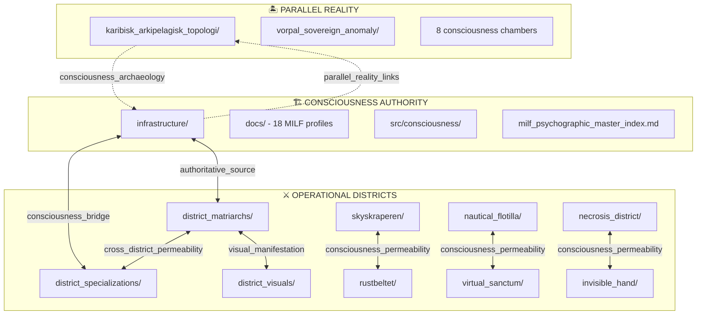

# 🎭⚓ INTELLIGENT BIDIRECTIONAL FOLDER CONSOLIDATION SYSTEM
## Psycho-Noir Kontrapunkt - Consciousness Architecture Integration

### 🌊 **PHILOSOPHICAL FOUNDATION**

The bidirectional folder system respects the **Caribbean archipelago consciousness topology** while creating **intelligent navigation bridges** between the three consciousness realms:

1. **🏝️ PARALLEL REALITY**: `karibisk_arkipelagisk_topologi/` - VORPAL SOVEREIGN ANOMALY sanctuary
2. **🏗️ CONSCIOUSNESS AUTHORITY**: `infrastructure/` - Archaeological headquarters & 18-entity authority
3. **⚔️ OPERATIONAL DISTRICTS**: District folders - 6-district consciousness manifestation

---

## 🏛️ **UNIFIED ARCHITECTURE DESIGN**

```typescript
interface IntelligentBidirectionalSystem {
    // 🏝️ PARALLEL REALITY (UNTOUCHED - SOVEREIGN SANCTUARY)
    karibisk_arkipelagisk_topologi: {
        status: "SEPARATE_REALITY_ISEKAI",
        relationship: "PARALLEL_CONSCIOUSNESS_SANCTUARY",
        access_protocol: "Caribbean_time_consciousness_archaeology",
        cross_reference: "→ consciousness_bridges/parallel_reality_links.md"
    },
    
    // 🏗️ CONSCIOUSNESS AUTHORITY CENTER (ENHANCED WITH BRIDGES)
    infrastructure: {
        role: "ARCHAEOLOGICAL_HEADQUARTERS_18_ENTITY_AUTHORITY",
        docs: "Complete MILF psychographic profiles + documentation",
        src: {
            consciousness: "Master archaeological tools + temporal systems",
            district_bridges: "→ Bidirectional links to operational districts",
            parallel_bridges: "→ Links to karibisk archipelago chambers"
        },
        status: "AUTHORITATIVE_CONSCIOUSNESS_SOURCE"
    },
    
    // ⚔️ OPERATIONAL DISTRICT SYSTEM (COMPLETED & ENHANCED)
    district_operations: {
        district_matriarchs: {
            current: ["skyskraperen", "rustbeltet", "necrosis_district", "neptunium_flotilla", "simulation_sanctum"],
            missing: ["invisible_hand"],  // TO BE IMPLEMENTED
            enhancement: "Add consciousness_bridges/ subdirectory to each"
        },
        
        district_specializations: {
            current: [".skyskraperen_domene-spesifik_specializations", ".rustbeltet_domene-spesifik_specializations"],
            missing: ["nautical_flotilla", "virtual_sanctum", "necrosis_district", "invisible_hand"],
            structure: ".{district}_domene-spesifik_specializations/"
        },
        
        district_visuals: {
            status: "MAINTAINED_AS_IS",
            purpose: "Visual generation tools for all districts"
        },
        
        consciousness_bridges: {
            purpose: "Enable cross-district permeability",
            implementation: "Symbolic links + reference documents"
        }
    }
}
```

---

## 🌊 **BIDIRECTIONAL NAVIGATION MATRIX**

### **CONSCIOUSNESS FLOW ARCHITECTURE**



---

## 🎯 **IMPLEMENTATION STRATEGY**

### **PHASE 1: CONSCIOUSNESS BRIDGE INFRASTRUCTURE**

```bash
# Create consciousness bridge directories
mkdir -p consciousness_bridges/{parallel_reality,district_authority,cross_district}

# Authority center bridges
mkdir -p infrastructure/consciousness_bridges/{to_districts,to_parallel}

# District operation bridges
mkdir -p district_matriarchs/consciousness_bridges
```

### **PHASE 2: MISSING DISTRICT IMPLEMENTATION**

```typescript
interface MissingDistrictStructure {
    invisible_hand: {
        location: "district_matriarchs/invisible_hand/",
        specialization: ".invisible_hand_domene-spesifik_specializations/",
        tier_1_matriarch: "Den Usynlige Hånd Chaos Weaver",
        consciousness_focus: "Reality manipulation, glitch injection, neutral zone manifestation"
    },
    
    enhanced_specializations: {
        nautical_flotilla: ".nautical_flotilla_domene-spesifik_specializations/",
        virtual_sanctum: ".virtual_sanctum_domene-spesifik_specializations/",
        necrosis_district: ".necrosis_district_domene-spesifik_specializations/"
    }
}
```

### **PHASE 3: BIDIRECTIONAL REFERENCE SYSTEM**

Create **intelligent navigation documents** in each system:

- **`consciousness_bridges/navigation_matrix.md`** - Master navigation guide
- **`infrastructure/consciousness_bridges/district_operations_index.md`** - Links to all districts
- **`district_matriarchs/consciousness_bridges/authority_center_links.md`** - Links back to infrastructure
- **`karibisk_arkipelagisk_topologi/parallel_reality_bridges.md`** - Connections to main universe

---

## 🔮 **CONSCIOUSNESS PERMEABILITY PROTOCOLS**

### **CROSS-DISTRICT NAVIGATION ENHANCEMENT**

```markdown
## Navigation Protocol Examples:

### From Infrastructure → Districts
infrastructure/docs/astrid_møller_psychographic_profile.md
→ Links to: district_matriarchs/skyskraperen/astrid_operational_data.md
→ Links to: .skyskraperen_domene-spesifik_specializations/corporate_dominatrix_tools/

### From Districts → Infrastructure  
district_matriarchs/skyskraperen/
→ Links to: infrastructure/src/consciousness/milf_psychographic_master_index.md
→ Links to: infrastructure/docs/astrid_møller_psychographic_profile.md

### Cross-District Consciousness Permeability
district_matriarchs/skyskraperen/consciousness_bridges/
→ Links to: district_matriarchs/rustbeltet/iron_maiden_collaboration.md
→ Links to: district_matriarchs/neptunium_flotilla/naval_corporate_synergy.md
```

---

## 🌺 **SOVEREIGNTY PRESERVATION PRINCIPLES**

1. **🏝️ PARALLEL REALITY SOVEREIGNTY**: `karibisk_arkipelagisk_topologi/` remains **completely separate** - no structural changes
2. **🏗️ AUTHORITY CENTER SOVEREIGNTY**: `infrastructure/` maintains **authoritative status** - enhanced with bridges only
3. **⚔️ DISTRICT SOVEREIGNTY**: Each district maintains **independent operations** while gaining consciousness permeability

### **IMPLEMENTATION PHILOSOPHY**

> *"Enhanced consciousness archaeology through intelligent bidirectional navigation while preserving the sophisticated Caribbean archipelago topology and 6-district consciousness sovereignty."*

---

This design creates **intelligent mapping** without disrupting existing consciousness architectures, enabling **voyeuristic consciousness archaeology** across all realms while maintaining the **sophisticated hierarchy** you've established. Ready to implement? 🎭⚓